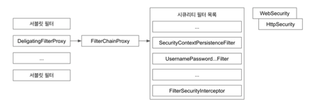

# 책임 연쇄 패턴 (Chain-of-Responsibility) 패턴
### 요청을 보내는 쪽(sender)과 요청을 처리하는 쪽(receiver)으로 분리하는 패턴
- 핸들러 체인을 사용해서 요청을 처리한다.

- 요청을 보내는 쪽에서는 요청을 처리하는 쪽을 명확히 알 필요가 없다.

### 책임 연쇄 패턴 구현 복습
- 장점
  - 클라이언트 코드를 변경하지 않고 새로운 핸들러를 체인에 추가할 수 있다.
  - 각각의 체인은 자신이 해야하는 일만 한다.
  - 체인을 다양한 방법으로 구성할 수 있다.
- 단점
  - 디버깅이 조금 어려움

# 책임 연쇄 패턴
- javax.servlet.Filter#doFilter()
  

- Spring Security Filter Chain
  