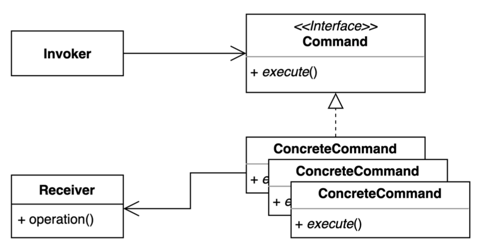

# 커맨드(Command) 패턴
### 요청을 캡슐화하여 호출자(invoker)와 수신자(receiver)를 분리하는 패턴

- 요청을 처리하는 방법이 바뀌더라도, 호출자의 코드는 변경되지 않는다.

### 커맨드 패턴 구현 복습
- 장점
  - 기존 코드를 변경하지 않고 새로운 커맨드를 만들 수 있다.
  - 수신자의 코드가 변경되어도 호출자의 코드는 변경되지 않는다.
  - 커맨드 객체를 로깅, DB에 저장, 네트워크로 전송하는 등 다양한 방법으로 활용할 수도 있다.
- 단점
  - 코드가 복잡하고 클래스가 많아진다.

# 커맨드 패턴
- 자바
  - java.lang.Runnable
  - 람다
  - 메소드 레퍼런스
- 스프링
  - SimpleJdbcInsert
  - SimpleJdbcCall