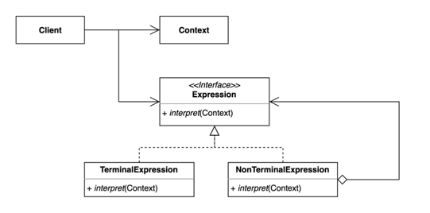
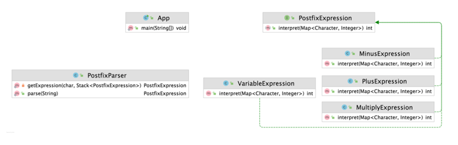

# 인터프리터(Interpreter) 패턴
### 자주 등장하는 문제를 간단한 언어로 정의하고 재사용하는 패턴

- 반복되는 문제 패턴을 언어 또는 문법으로 정의하고 확장할 수 있다.

- 요청을 캡슐화하여 호출자(invoker)와 수신자(receiver)를 분리하는 패턴

### 인터프리터 패턴 구현 복습
- 장점
  - 자주 등장하는 문제 패턴을 언어와 문법으로 정의할 수 있다
  - 기존 코드를 변경하지 않고 새로운 Expression을 추가할 수 있다.
- 단점
  - 복잡한 문법을 표현하려면 Expression과 Parser가 복잡해진다.

# 인터프리터 패턴
- 자바
  - 자바 컴파일러
  - 정규 표현식
- 스프링
  - SpEL(스프링 표현 언어)