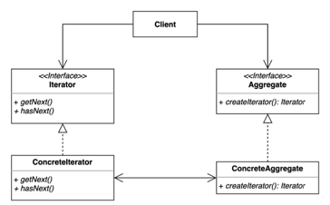
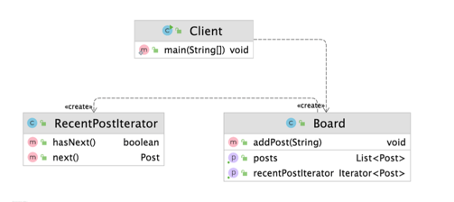

# 이터레이터(Iterator) 패턴
### 집합 객제 내부 구조를 노출시키지 않고 요소들을 순회하는 방법
- 집합 객체를 순회하는 클라이언트 코드를 변경하지 않고 다양한 순회 방법을 제공할 수 있다.

### 이터레이터 패턴 구현 복습
- 장점
  - 집합 객체가 가지고 있는 객체들에 손쉽게 접근 가능
  - 집합 객체가 어떠한 타입의 객체들로 이루어져 있던지 상관없이 일관된 인터페이스를 사용하여 여러 형태의 집합 구조를 순회할 수 있다.
- 단점
  - 클래스가 늘어나고 복잡도가 증가한다.

# 이터레이터 패턴
- 자바
  - java.util.Enumeration, java.util.Iterator
  - Java StAX(Streaming API for XML)의 Iterator 기반 API
    - XmlEventReader, XmlEventWriter
- 스프링
  - CompositeIterator