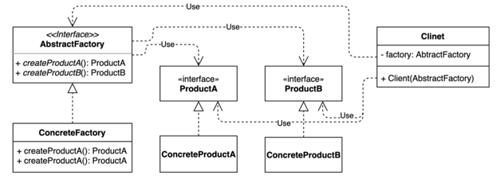
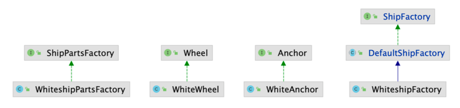

# 추상 팩토리(Abstract factory) 패턴
### 서로 관련 있는 여러 객체를 만들어주는 팩토리를 추상화된 형태로 정의
- 팩토리 메소드에서 구체적인 어떤 클래스의 인스턴스(concrete product)를 만드는 것까지는 유사
- 초점을 클라이언트에게 맞춰서 바라보면 추상 팩토리가 될 수 있다.
- 목적
  - 클라이언트에서 만드는 것을 인터페이스 기반으로 만들 수 있도록 도와주는 패턴

- 클라이언트 코드에서 구체적인 클래스의 의존성을 제거한다.

### 추상 팩토리 패턴 복습
#### 팩토리 메소드 패턴과 매우 유사한데 무엇이 다를까?
- 모양과 효과가 비슷
  - 둘 다 구체적인 객체 생성 과정을 추상화한 인퍼테이스를 제공
- 관점 차이가 있다.
  - 팩토리 메소드 패턴은 "팩토리를 구현하는 방법(inheritance)"에 초점을 맞춤
  - 추상 팩토리 패턴은 "팩토리를 사용하는 방법(composition)"에 초점을 맞춤
- 목적이 다르다
  - 팩토리 메소드 패턴은 구체적인 객체 생성 과정을 하위 또는 구체적인 클래스로 옮기는 것이 목적
  - 추상 팩토리 패턴은 관련있는 여러 객체를 구체적인 클래스에 의존하지 않고 만들 수 있게 해주는 것이 목적

# 추상 팩토리 패턴
- 자바 라이브러리
  - javax.xml.xpath.XPathFactory#newInstance()
  - javax.xml.transform.TransformerFactory#newInstance()
  - javax.xml.parsers.DocumentBuilderFactory#newInstance()
- 스프링
  - FactoryBean과 그 구현체
  