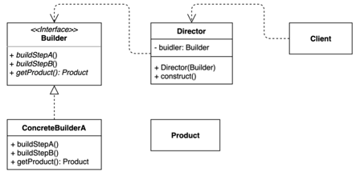

# 빌더(Builder) 패턴
### 동일한 프로세스를 거쳐 다양한 구성의 인스턴스를 만드는 방법
- (복잡합) 객체를 만드는 프로세스를 독립적으로 분리할 수 있다.

### 빌더 패턴 구현 복습
- 장점
  - 만들기 복잡한 객체를 순차적으로 만들 수 있다.
  - 복잡한 객체를 만드는 구체적인 과정을 숨길 수 있다.
  - 동일한 프로세스를 통해 각기 다르게 구성된 객체를 만들 수도 있다.
  - 불완전한 객체를 사용하지 못하도록 방지할 수 있다.
- 단점
  - 원하는 객체를 만들려면 빌더부터 만들어야 한다.
  - 구조가 복잡해진다(트레이드 오프).

# 빌터 패턴
- Java 8 Stream.Builder API
- StringBuilder는 빌더 패턴일까?
- 롬복의 @Builder
  - https://projectlombok.org/features/Builder
- 스프링
  - UriComponentsBuilder
  - MockMvcWebClientBuilder
  - ...Builder