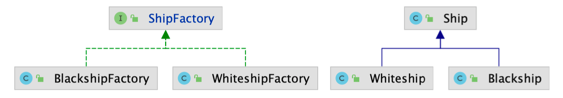

# 팩토리 메소드(Factory method) 패턴
### 구체적으로 어떤 인스턴스를 만들지는 서브 클래스가 정한다.
- 다양한 구현체(Product)가 있고, 그 중에서 특정한 구현체를 만들 수 있는 다양한 팩토리(Creator)를 제공할 수 있다.


### 팩토리 메소드 패턴 구현 방법
- 확장에 열러있고 변경에 닫혀 있는 구조(OCP - 개방 폐쇄 원칙)



### 팩토리 메소드 패턴 복습
- 팩토리 메소드 패턴을 적용했을 때의 장점과 단점
  - 장점
    - 기존 인스턴스를 만드는 과정들의 코드를 건들이지 않고, 그와 같은 종류의 새로운 인스턴스를 다른 방법으로 얼마든지 확장이 가능
    - Product와 Creator(Factory) 간의 Coupling을 느슨하게 가져갈 수 있다 => 느슨한 결합
    - if 또는 switch 문으로 분기 처리하여 인스턴스를 생성했던 것을 클라인트가 원하는 방식을 선택하게 하여 분기 처리없이 로직을 추가할 수 있다.
  - 단점
    - 각자의 역할을 나누게 되다보니 클래스가 많아진다.
- "확장에 열려있고 변경에 닫혀있는 객체 지향 원칙" 설명
  - 확장에 열려있다 => 인스페이스를 구현하는 새로운 클래스를 작성하여 새로운 기능을 얼마든지 확장할 수 있다
  - 변경에 닫혀있다 => 기존 코드를 변경하지 않는다
- 자바 8에 추가된 default 메소드에 대해 설명
  - 인터페이스에 대한 기본적인 기능을 만들 수 있다.
  - 인터페이스를 상속받는 모든 클래스에 공통으로 사용할 메소드를 작성할 때 사용하며 하위 클래스는 해당 함수를 그대로 사용하거나 오버라이딩하여 수정할 수도 있다.
- 자바 8에 추가된 static 메소드에 대해 설명
  - 이전에는 static 메소드는 class 에서만 정의할 수 있었고 인스턴스와 관련 있다기 보다는 클래스와 관련이 있으며, 모든 인스턴스가 공유할 수 있는 기능으로 만들었다.
  - 자바 8에서는 이러한 static 메소드를 인터페이스에서 관리할 수 있다.
    ```java
    public interface TimeClient {
      static ZoneId getZoneId (String zoneString) {
        try {
          return ZoneId.of(zoneString);
        } catch (DateTimeException e) {
          System.err.println("Invalid time zone: " + zoneString +
          "; using default time zone instead.");
          return ZoneId.systemDefault();
        }
      }

      default public ZonedDateTime getZonedDateTime(String zoneString) {
          return ZonedDateTime.of(getLocalDateTime(), getZoneId(zoneString));
      }    
    }
    ```
- 자바 9에 추가된 인터페이스의 private 메소드에 대해 설명
  - 자바 9 이후부터는 인터페이스에서 private method와 private static method가 가능
  - 이러한 기능으로 인터페이스 내 코드 재사용성이 개선됨
  - 예를 들어 인터페이스의 default methods가 동일한 코드를 가지고 있다면 이 부분을 private method로 빼내어 처리 가능
  - 인터페이스 내 private method 규칙
    - Private interface method cannot be abstract. 
    - Private method can be used only inside interface. 
    - Private static method can be used inside other static and non-static interface methods. 
    - Private non-static methods cannot be used inside private static methods.
    ```java
    public interface CustomInterface {
    
        public abstract void method1();
         
        public default void method2() {
            method4();  //private method inside default method
            method5();  //static method inside other non-static method
            System.out.println("default method");
        }
         
        public static void method3() {
            method5(); //static method inside other static method
            System.out.println("static method");
        }
         
        private void method4(){
            System.out.println("private method");
        } 
         
        private static void method5(){
            System.out.println("private static method");
        } 
    }
    
    public class CustomClass implements CustomInterface {
    
        @Override
        public void method1() {
            System.out.println("abstract method");
        }
         
        public static void main(String[] args){
            CustomInterface instance = new CustomClass();
            instance.method1(); // OK
            instance.method2(); // OK
            instance.method4(); // Compile Error 
            
            CustomInterface.method3(); // OK
            CustomInterface.method5(); // Compile Error 
        }
    }
    ```

# 팩토리 메소드 패턴
- 단순한 팩토리 패턴
  - 매개변수의 값에 따라 또는 메소드에 따라 각기 다른 인스턴스를 리턴하는 단순한 버전의 팩토리 패턴
  - java.lang.Calender 또는 java.lang.NumberFormat
- 스프링 BeanFactory
  - Object 타입의 Product를 만드는 BeanFactory라는 Creator