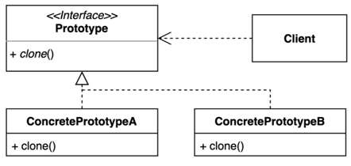
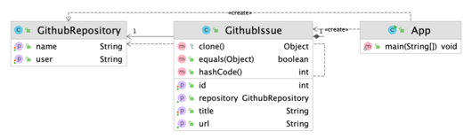

# 프로토타입(Prototype) 패턴
### 기존 인스턴스를 복제하여 새로운 인스턴스를 만드는 방법
- 복제 기능을 갖추고 있는 기존 인스턴스를 프로토타입으로 사용해 새 인스턴스를 만들 수 있다.

### 프로토타입 구현
- Object 클래스를 보면 clone 이라는 메소드가 있음. 하지만 이 메소드는 protected 이기 때문에 바로 사용불가능
- clone 메소드를 사용하기 위해서는 해당 클래스는 Cloneable 인터페이스를 상속받아야 한다.
- 그러면 clone 메소드를 오버라이딩할 수 있게 됨

### 프로토타입 패턴 구현 복습
- 프로토타입은 Shallow Copy를 한다.(즉, Deep Copy가 아님)
  - 얕은 복사란, 기존 객체가 가지고 있는 레퍼런스(예시에서는 GitHubIssue가 받아야하는 GitRepository)도 그대로 복사해서 같은 레퍼런스를 사용한다.
- 장점
  - 복잡한 객체를 만드는 과정을 숨길 수 있다.
  - 기존 객체를 복제하는 과정이 새 인스턴스를 만드는 것보다 비용(시간 또는 메모리)적인 면에서 효율적일 수도 있다.
  - 추상적인 타입을 리턴할 수 있다.
- 단점
  - 복제한 객체르 만드는 과정 자체가 복잡할 수 있다.(특히, 순환 참조가 있는 경우)

### 프로토 타입 패턴
- 자바 Object 클래스의 clone 메소드와 Cloneable 인터페이스
- shallow copy와 deep copy
- ModelMapper