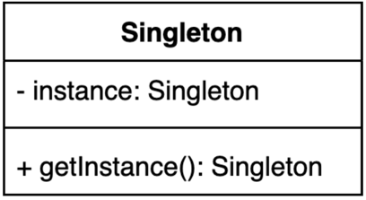

# 싱글톤(Singleton) 패턴
### 인스턴스를 오직 한개만 제공하는 클래스
- 시스템 런타임, 환경 세팅에 대한 정보 등 인스턴스가 여러 개일 때 문제가 생길 수 있는 경우가 있음
- 인스턴스를 오직 한 개만 만들어 제공(글로벌하게 접근)하는 클래스가 필요



#### 싱글톤 패턴 구현 방법 1
- private 생성자에 static 메소드

```java
public class Settings {

  private static Settings instance;
  
  private Settings() {
  }
  
  public static Settings getInstance() {
      if (instance == null) {
        instance = new Settings();
      }
      return instance;
  }
}
```

- 생성자를 private로 만든 이유?
  - 외부에서 접근하지 못하도록 막아서 new 키워드를 통해 생성할 수 없도록 함
- getInstance() 메소드를 static으로 선언한 이유?
  - 글로벌하게 접근할 수 있도록 하기 위해서
- getInstance() 메소드가 멀티쓰레드 환경에서 안전하지 않은 이유?
  - 다수의 쓰레드가 if 문을 통해 다음 줄로 넘어가 동시에 new Settings() 실행하게 되면 각 쓰레드가 가지고 았는 인스턴스가 달라지게 된다.

### 싱글톤 패턴 구현 방법 2
- 동기화(synchronized)를 사용해 멀티쓰레드 환경에 안전하게 만들 수 있다.

```java
public class Settings {

  private static Settings instance;

  private Settings() {
  }
  
  // synchronized 키워드를 통해서 한 번에 딱 하나의 쓰레드만 들어올 수 있도록 함
  // 하지만 해당 메서드를 호출할 때마다 동기화 처리를 해야하기 때문에 성능에 불이득이 생긴다.
  public static synchronized Settings getInstance() { 
    if (instance == null) {
      instance = new Settings();
    }
    return instance; 
  }
}
```

- 자바의 동기화 블럭 처리 방법은?
  - 메소드에 synchronized 키워드를 사용
- getInstance() 메소드 동기화 시 사용하는 락(lock)은 인스턴스 락인지 클래스의 락인지?
  - synchronized 키워드는 객체 단위의 락이다. 
  - 그 이유는 동기화를 하는 이유가 인스턴스 변수 조작을 순차적으로 하기 위함인데, 객체 단위의 락을 하지 않으면 synchronized 키워드가 걸리지 않은 다른 함수에서 해당 값을 조작하거나 조회할 경우 동기화하는 이유가 없어지기 때문이다.


- 객체를 생성하는데 비용이 적고, synchronized 키워드에 의한 성능 저하가 우려된다면?

### 싱글톤 패턴 구현 방법 3
이른 초기화 (eager initialization)

```java
public class Settings {

  private static final Settings INSTANCE = new Settings();

  private Settings() {
  }
  
  public static Settings getInstance() { 
    return INSTANCE;
  }
}
```
위와 같이 미리 객체를 생성해두고 생성된 것만 전달하게 해주면 된다.
이를 이른 초기화(eager initialization)이라 한다.
또한, 이 방법은 thread-safe 하기도 하다.

- 이른 초기화의 단점?
  - 해당 인스턴스를 만드는 비용이 큼에도 불구하고 사용하지 않는다면 리소스에 대한 낭비가 된다.
- 만약에 생성자에서 checked 예외를 던진하면 이 코드를 어떻게 변경해야 하는가?
  - 기본적으로 함수에서 checked exception을 던지면 함수를 호출하는 쪽에서 try-catch 문을 사용해야 한다. 
  - 하지만 위와 같이 변수를 초기화하는 과정에서는 try-catch문을 사용할 수 없다.
  - 그럴 경우 static {} 블록을 사용해서 instance를 초기화하면 되는데 이 경우에는 final을 사용할 수 없게 된다.

그렇다면, 해당 인스턴스를 나중에 사용될 때 만들고 싶은데 그렇게 하자니 synchronized 블록의 비용이 신경 쓰인다면 어떻게 할 수 있나?

### 싱글톤 패턴 구현 방법 4
double checked locking으로 효율적인 동기화 블록 만들기

```java
public class Singleton {

  private static volatile Singleton instance;

  private Singleton() {
  }

  public static Singleton getInstance() {
    if (instance == null) {
      synchronized (Singleton.class) { // class lock
        if (instance == null) {
          instance = new Singleton4();
        }
      }
    }
    return instance;
  }
}
```

- double check locking이라고 부르는 이유?
  - instance == null 체크를 밖에서 한번, synchronized 블록 안에서 한번 더 한다고 해서 double check locking이라 한다.
  - 두 개 이상의 쓰레드가 동시에 첫 번째 if 문으로 들어오더라도 synchronized 블록 안에는 하나의 쓰레드 이미 진입되어 있다면, 나머지는 진입하지 못함
- 왜 getInstance() 메소드에 synchronized 키워드를 사용하는 것보다 좋은가?
  - 해당 메소드를 호출할 때마다 synchronized 키워드에 의해 동기화하지 않기 때문. 인스턴스가 이미 있는 경우 동기화 처리를 하지 않게 된다.
- instance 변수는 어떻게 정의해야 하는가? 그 이유는?
  - volatile 키워드를 변수에 넣어줘야 함. 
  - volatile 키워드를 사용하지 않은 변수는 성능 향상을 위해 CPU 캐시에 저장하는데, 쓰레드가 변수값을 읽어올 때 각각의 CPU 캐시에서 가져오기 때문에 값이 달라 값의 불일치가 발생한다.

위와 같은 로직은 복잡하고, volatile 키워드를 사용하고 싶지 않다. 그러면 어떻게 하느냐?

### 싱글톤 패턴 구현 방법 5
static inner 클래스를 사용

```java
public class Singleton {
  
  private Singleton() {
  }

  private static class SettingsHolder {
    private static final Singleton SINGLETON = new Singleton();
  }

  public static Singleton getInstance() {
    return SettingsHolder.SINGLETON;
  }
}
```

멀티쓰레드 환경에서도 안전하고, getInstance()가 호출될 때 SettingsHolder 클래스가 로딩되면서 만들기 때문에 lazy loading도 가능한 코드가 된다.

- 이 방법은 static final를 썼는데도 왜 지연 초기화 (lazy initialization)라고 볼 수 있는가?
  - static final로 선언되어 있지만 해당 변수가 선언된 클래스는 getInstance() 함수가 호출될 때 로딩되기 때문에 지연 초기화로 볼 수 있다.

### 싱글톤 패턴 구현 깨트리는 방법 1
리플렉션 사용?

```java
public class SingletonDestroy {

  public static void main(String[] args)
    throws NoSuchMethodException, InvocationTargetException, InstantiationException, IllegalAccessException {
    Singleton5 singleton = Singleton5.getInstance();
    Singleton5 singleton1 = Singleton5.getInstance();

    Constructor<Singleton5> constructor = Singleton5.class.getDeclaredConstructor();
    constructor.setAccessible(true);
    Singleton5 singleton2 = constructor.newInstance();

    System.out.println(singleton == singleton1); // true
    System.out.println(singleton == singleton2); // false
  }

}
```

- 리플렉션이란?
  - 구체적인 클래스 타입을 몰라도 안에 선언되어 있는 함수, 변수들에 접근할 수 있게 해주는 자바 API
- setAccessible(true)를 해주는 이유는?
  - 기본 생성자를 private로 선언하게 되면 외부에서 접근을 막는 것
  - 그러나 setAccessible(true)를 사용하게 되면 Constructor<> 타입으로 받은 declaredConstructor, 기본 생성자를 사용 가능하도록 해주어 newInstance()를 사용해 새로운 객체를 만들 수 있게 하기 때문

### 싱글톤 패턴 구현 깨트리는 방법 2
직렬화 & 역직렬화

```java
/*
  public class Singleton5 implements Serializable { ... }
 */

public class SingletonDestroy {

  public static void main(String[] args) throws IOException, ClassNotFoundException {
    Singleton5 singleton = Singleton5.getInstance();
    Singleton5 singleton1 = null;
    // try-resource
    // 직렬화
    try (ObjectOutput out = new ObjectOutputStream(new FileOutputStream("singleton.obj"))) {
      out.writeObject(singleton);
    }

    // 역직렬화 -> 반드시 생성자를 통해 인스턴스를 새롭게 만들어줌
    try (ObjectInput in = new ObjectInputStream(new FileInputStream("singleton.obj"))) {
      singleton1 = (Singleton5) in.readObject();
    }

    System.out.println(singleton == singleton1); // false
  }
}

```

- 자바의 직렬화 & 역직렬화에 대해 설명
  - 직렬화
    - 자바 시스템 내부에서 사용되는 Object 또는 Data를 외부의 자바 시스템에서도 사용할 수 있도록 byte 형태로 데이터를 변환하는 기술
  - 역직렬화
    - byte로 변환된 Data를 원래대로 Object나 Data로 변환하는 기술
- Serializable Id란 무엇이며 왜 쓰는가?
  - Serializable를 상속받는 경우 클래스의 버전 관리를 위해 serialVersionUID를 사용한다.
  - 이 serialVersionUID 변수를 명시적으로 선언해주지 않으면 컴파일러가 계산한 값을 부여하는데 Serializable Class 또는 Outer Class에 변경이 있으면 serialVersionUID 값이 바뀌게 된다.
  - 만약 Serialize 할 때와 Deserialize할 때의 serialVersionUID 값이 다르면 InvalidClassException이 발생하여 저장된 값을 객체로 Restore할 수 없다.
- try-resource 블록에 대해 설명
  - 기존 try-catch-final 블록에서 사용하고 꼭 종료해줘야 하는 resource를 사용할 때 final 블록에서 해당 resoruce들을 해제한다.
  - try-resource 블록을 사용하면 따로 명시적으로 resource를 해제해주지 않아도 자동으로 해제해준다.

### 역직렬화 대응 반안

```java
public class Singleton implements Serializable {

  private Singleton() {
  }

  private static class SettingsHolder {
    private static final Singleton SINGLETON = new Singleton();
  }

  public static Singleton getInstance() {
    return SettingsHolder.SINGLETON;
  }
  
  // readResolve 메소드가 명시적으로 만들어져 있지않지만, 이를 오버라이딩 해주면 된다.
  protected Object readResolve() {
    return getInstance();
  }
}
```
역직렬화를 할 때 readResolve 메소드를 사용하는데 이를 오버라이딩하여 getInstance() 함수의 리턴값을 리턴해주면 싱글톤 패턴을 지킬 수 있다.

리플렉션은 위의 싱글톤 구현 방법들로는 대응 불가...

### 싱글톤 패턴 구현 방법 6
enum 사용

```java
public enum Singleton {

  INSTANCE;
}
```

- Enum 타입의 인스턴스는 리플렉션을 통해 만들 수 없다. -> Cannot reflectively create enum objects
- Enum 타입으로 싱글톤 패턴을 구현할 때의 단점은?
  - 인스턴스를 미리 생성해야하며, 상속 불가
- 직렬화 & 역직렬화 시에 별도로 구현해야 하는 메소드가 있는가?
  - enum은 기본적으로 Enum이라는 클래스를 상속받고 있고, 이 클래스는 이미 Serializable을 상속하고 있기 때문에 enum도 별다른 안전장치를 마련하지 않아도 안전한 직렬화 & 역직렬화가 가능하다.
