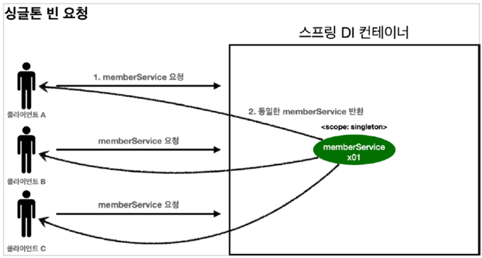
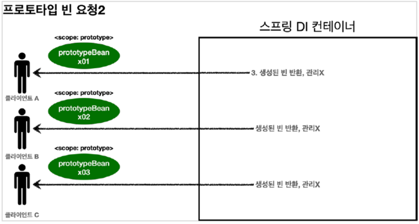
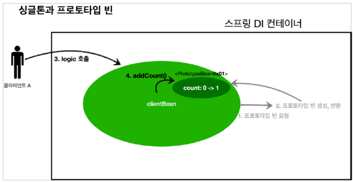

### 스프링 빈 스코프
말 그대로 빈이 존재할 수 있는 범위를 뜻함.
- 싱글톤(Singleton): 기본 스코프, 스프링 컨테이너의 시작과 종료까지 유지되는 가장 넓은 범위의 스코프
  
    - 싱글톤 스코프의 빈을 조회하면 스프링 컨테이너는 항상 같은 인스턴스의 빈을 반환한다.
    - 싱글톤 빈은 컨테이너 생성 시점에 같이 생성되고 초기화

- 프로토타입(Prototype): 스프링 컨테이너는 프로토타입 빈의 생성과 의존 관계 주입까지만 관여하고 더는 관리하지 않는 매우 짧은 범위의 스코프
  
    - 프로토타입 빈은 스프링 컨테이너에서 빈을 조회할 때 초기화 메서드로 실행
    - 프로토타입의 빈을 스프링 컨테이너에 요청하면 스프링 컨테이너는 프로토타입의 빈을 생성하고, 의존관계 주입, 초기화까지만 처리
    - 스프링 컨테이너는 클라이언트에게 빈을 반환한 이후에는 생성된 프로토타입 빈을 관리하지 않게되고, 프로토타입 빈을 관리할 책임은 클라이언트에게 있게 된다.
        - 따라서, @PreDestroy 와 같은 종료 콜백 메서드가 호출되지 않는다.
    - 프로토타입 빈의 문제점
      - 만약 싱글톤 빈과 프로토타입 빈을 같이 사용하면?

        
      
      - 위 그림처럼 clientBean이 프로토타입 빈을 포함한다고 했을 때, clientBean은 싱글톤이므로 스프링 컨테이너 생성 시점에 함께 생성되고, 의존 관계 주입도 발생한다.
      1. clientBean은 의존 자동 주입을 사용한다. 주입 시점에 스프링 컨테이너에게 프로토타입 빈을 요청
      2. 스프링 컨테이너는 프로토타입 빈에 대한 요청을 받고, 프로토타입 빈을 생성하여 clientBean에게 반환. 프로토타입 빈의 count 필드값을 0
      
      clientBean은 프로토타입 빈을 내부 필드에 보관한다.
      
      

      - 클라이언트 A는 clientBean을 스프링 컨테이너에게 요청해서 받음. 싱글톤이므로 항상 같은 clientBean이 반환
      3. 클라이언트 A는 clientBean.logic()을 호출
      4. clientBean은 PrototypeBean의 addCount() 메소드를 호출 -> count 값을 증가시킴 -> count = 1
      
      

      - 클라이언트 B는 clientBean을 스프링 컨테이너에게 요청해서 클라이언트 A와 같은 빈을 받음.
      - 중요한 점은 clientBean 내부에 가지고 있는 프로토타입 빈은 이미 과거에 주입이 끝난 빈이다.
      - 주입 시점에 스프링 컨테이너에 요청해서 프로토타입 빈이 새로 생성된 것, 사용할 때마다 새로 생성되는 것이 아님!
      - 즉, 클라이언트 A와 B는 같은 clientBean을 가지고 있고, 그 내부에 있는 ProtoTypeBean 또한, 같은 것
      5. 클라이언트 B가 clientBean.logic() 호출
      6. clientBean은 prototypeBean의 addCount() 메소드를 호출 -> count = 2
      
      새 클라이언트의 요청마다 count 값을 1로 반환받는 것을 기대하지만 2를 받게 됨.
      스프링은 일반적으로 싱글톤 빈을 사용하므로, 싱글톤 빈이 프로토타입 빈을 사용하게 된다. 그런데 싱글톤 빈은 생성 시점에만 의존 관계를 주입받는다.
      따라서 **스프링 싱글톤 빈이 생성되는 시점에 프로토 타입 빈도 새로 생성되어 주입되지만, 싱글톤 빈과 함께 계속 유지되는 것이 문제**
      즉, 프로토타입 빈을 주입 시점에만 새로 생성하는 것이 아니라, 사용할 때마다 새로 생성해서 사용해야 한다.

  #### Dependency Lookup(DL)과 Provider
  - 싱글톤 빈과 프로토타입 빈을 같이 사용할 때, 프로토타입 빈을 사용할 때마다 항상 새로운 빈을 생성하는 방법
  1. 싱글톤 빈이 프로토타입 빈을 사용할 때마다 스프링 컨테이너에게 요청하기
     1. ApplicationContext 에게 매번 getBean 메소드를 호출하여 새로운 프로토타입 빈을 받도록 함
     2. 이처럼 외존관계를 외부에서 주입(DI) 받는 것이 아니라 직접 필요한 의존 관계를 getBean을 통해 가져오는 것을 Dependency Lookup, 의존 관계 조회(탐색)이라 한다.
     3. 하지만 이렇게 스프링 애플리케이션 컨텍스트 전체를 주입받게 되면, 스프링 컨테이너에 종속적인 코드가 되고, 단위 테스트 또한 어려워진다.
  2. ObjectProvider를 사용하여 지정한 빈을 컨테이너에서 대신 DL 서비스를 해준다.
     1. 과거에는 ObjectFactory가 있었는데, 편의 기능을 추가하여 ObjectProvider가 되었음
     2. ObectProvider 의 getObejct()를 호출하면 내부에서는 스프링 컨테이너를 통해 해당 빈을 찾아서 반환한다. (DL)
     3. 스프링이 제공하는 기능을 사용하지만, 기능이 단순해 단위 테스트를 만들거나 mock 코드를 만들기 쉽다.
     4. 스프링에 의존하지만 별도 라이브러리가 필요 없음
     5. ObjectProvider는 DL 정도의 기능만 제공

- 웹 관련 스코프
  - 웹 스코프는 웹 환경에서만 동작
  - 웹 스코프는 프로토타입과 다르게 스프링이 해당 스코트의 종료 시점까지 관리한다.
  - 따라서 종료 메서드가 호출됨
  
    - request
      - HTTP 요청 하나가 들어오고 나갈때 까지 유지되는 스코프
      - 각각의 HTTP 요청마다 별도의 빈 인스턴스가 생성되고 관리됨
    - session: HTTP 세션과 동일한 생명주기를 가지는 스코프
    - application: 웹의 서블릿 컨텍스트와 같은 범위로 유지되는 스코프
    - websocket: 웹 소켓과 같은 생명 주기를 가지는 스코프
  스프링 빈 등록 시 웹 스코프를 그대로 주입받으면 오류가 발생한다. 싱글톤 빈은 스프링 컨테이너 생성 시 함께 생성되어서 라이프 사이클을 같이 하지만, 