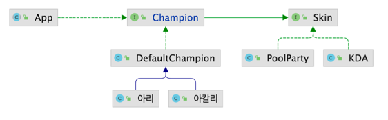

# 브릿지(Bridge) 패턴
### 추상적인 것과 구체적인 것을 분리하여 연결하는 패턴
- 하나의 계층 구조일 때 보다 각기 나누었을 때 독립적인 계층 구조로 발전 시킬 수 있다.

- Abstraction & Refined Abstraction: 추상적인 부분
- Implementation & Concrete Implementation: 구체적인 부분
- 항상 위와 같은 방식으로 나뉘어지는 것은 아니고, 성격이 상이한 것들을 분리한 후 이 둘 사이를 연결하는 것을 브릿지 패턴이라 함
- Client는 Implementation을 직접적으로 사용하지 않고 추상적인 계층 구조만을 사용할 것
  - 추상적인 계층을 사용함으로써 간접적으로 Implementation를 사용하게 됨

### 브릿지 패턴 구현
- 장점 => OCP, SRP
  - 추상적인 코드를 구체적인 코드 변경없이도 독립적으로 확장할 수 있다.
  - 추상적인 코드와 구체적인 코드를 분리할 수 있다.
- 단점
  - 계층 구조가 늘어나 복잡도가 증가할 수 있다.

### 브릿지 패턴
- 자바
  - JDBC API, DriverManager와 Driver
  - SLF4J, 로깅 퍼사드와 로거
- 스프링
  - Portable Service Abstraction