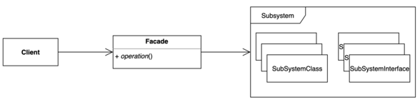
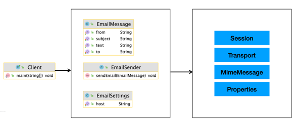

# 퍼사드(Facade) 패턴
### 복잡한 서브 시스템 의존성을 최소화하는 패턴
- 클라이언트가 사용해야 하는 복잡한 서브 시스템 의존성을 간단한 인터페이스로 추상화할 수 있다.

### 퍼사드 패턴 구현
- 장점
  - 서브 시스템에 대한 의존성을 한 곳으로 모을 수 있다.
- 단점
  - 퍼사드 클래스가 서브 시스템에 대한 모든 의존성을 가지게 된다.

### 퍼사드 패턴
- 스프링
  - Spring MVC
  - 스프링이 제공하는 대부분의 기술 독립적인 인터페이스와 그 구현체