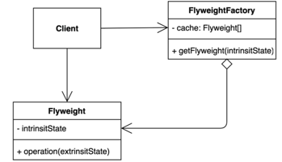
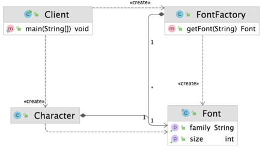

# 플라이웨이트(Flyweight) 패턴
### 객체를 가볍게 만들어 메모리 사용을 줄이는 패턴
- 자주 변하는 속성(또는 외적인 속성, extrinsic)과 변하지 않는 속성(또는 내적인 속성, intrinsic)을 분리하고 재사용하여 메모리 사용을 줄일 수 있다.

### 플라이웨이트 패턴 구현
- 장점
  - 애플리케이션에서 사용하는 메모리를 줄일 수 있다.
- 단점
  - 코드의 복잡도 증가

### 플라이웨이트 패턴
- 자바
  - Integer.valueOf(int)
  - 캐시 제공
  - https://docs.oracle.com/javase/8/docs/api/java/lang/Integer.html#valueOf-int-