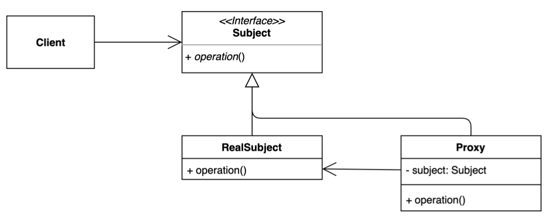
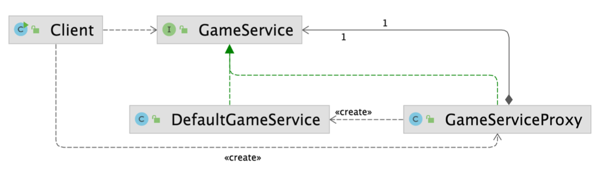

# 프록시(Proxy) 패턴
### 특정 객체에 대한 접근을 제어하거나 기능을 추가하는 패턴
- 초기화 지연, 접근 제어, 로깅, 캐싱 등 다양하게 응용해 사용할 수 있다.

### 프록시 패턴 구현
- 장점
  - 기존 코드를 변경하지 않고 새로운 기능을 추가할 수 있다.
  - 기존 코드가 해야하는 일만 유지할 수 있다.
  - 기능 추가 및 초기화 지연 등으로 다양하게 활용할 수 있다.
- 단점
  - 코드의 복잡도가 증가한다.

### 프록시 패턴
- 자바
  - 다이나믹 프록시, java.lang.reflect.Proxy
- 스프링
  - 스프링 AOP